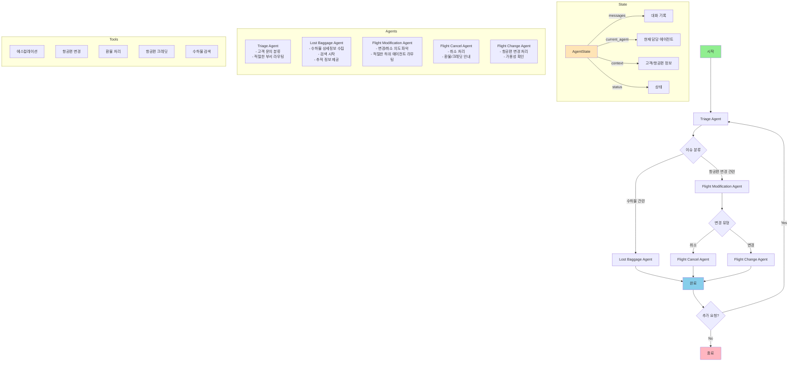

```mermaid
graph TD
    %% Main Flow
    Start[시작] --> Triage[Triage Agent]
    
    %% Triage Decision
    Triage --> TriageDecision{이슈 분류}
    TriageDecision -->|수하물 관련| LostBaggage[Lost Baggage Agent]
    TriageDecision -->|항공편 변경 관련| FlightMod[Flight Modification Agent]
    
    %% Flight Modification Flow
    FlightMod --> ModDecision{변경 유형}
    ModDecision -->|취소| FlightCancel[Flight Cancel Agent]
    ModDecision -->|변경| FlightChange[Flight Change Agent]
    
    %% Completion Paths
    LostBaggage --> Complete[완료]
    FlightCancel --> Complete
    FlightChange --> Complete
    
    %% Return to Triage
    Complete --> ReturnDecision{추가 요청?}
    ReturnDecision -->|Yes| Triage
    ReturnDecision -->|No| End[종료]
    
    %% State Management
    subgraph State
        direction LR
        StateBox[AgentState]
        StateBox -->|messages| Messages[대화 기록]
        StateBox -->|current_agent| CurrentAgent[현재 담당 에이전트]
        StateBox -->|context| Context[고객/항공편 정보]
        StateBox -->|status| Status[상태]
    end
    
    %% Agent Capabilities
    subgraph Agents
        direction TB
        TriageCapabilities[Triage Agent<br/>- 고객 문의 분류<br/>- 적절한 부서 라우팅]
        BaggageCapabilities[Lost Baggage Agent<br/>- 수하물 상세정보 수집<br/>- 검색 시작<br/>- 추적 정보 제공]
        ModificationCapabilities[Flight Modification Agent<br/>- 변경/취소 의도 파악<br/>- 적절한 하위 에이전트 라우팅]
        CancelCapabilities[Flight Cancel Agent<br/>- 취소 처리<br/>- 환불/크레딧 안내]
        ChangeCapabilities[Flight Change Agent<br/>- 항공편 변경 처리<br/>- 가용성 확인]
    end
    
    %% Tools
    subgraph Tools
        direction TB
        EscalateTool[에스컬레이션]
        FlightChangeTool[항공편 변경]
        RefundTool[환불 처리]
        CreditsTool[항공편 크레딧]
        BaggageSearchTool[수하물 검색]
    end

    style Start fill:#90EE90
    style End fill:#FFB6C1
    style Complete fill:#87CEEB
    style StateBox fill:#FFE4B5
```